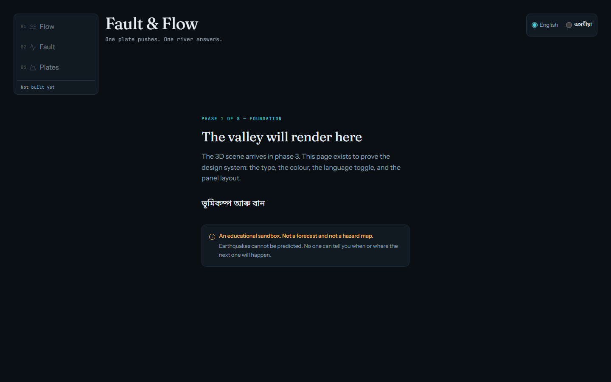

# Fault & Flow

> **One plate pushes. One river answers.**

An interactive 3D sandbox of Assam's earth and water, running entirely in the browser.

---

## ⚠️ Work in progress — this is not a forecast

**This is an educational sandbox. It is not a forecast, not a hazard map, and not a
prediction tool.** Right now the repository contains documentation, a design system, and
a placeholder page. There is no simulation and no 3D scene yet.

Three rules shape everything in this project, and they are not negotiable:

1. **Earthquakes cannot be predicted.** No one can tell you when or where the next one will
   happen. We will never claim otherwise, or imply it with future-tense language.
2. **Flood visuals are illustrative**, not modelled forecasts.
3. **Unknown is a value.** An unavailable measurement renders as "—" with a reason, never
   as `0` and never as an invented number.

For actual warnings and official flood information, go to the authorities:

| Body | URL |
| --- | --- |
| **ASDMA** — Assam State Disaster Management Authority | <https://asdma.assam.gov.in/> |
| **NCS** — National Center for Seismology, Ministry of Earth Sciences | <https://seismo.gov.in/> |
| **IMD** — India Meteorological Department | <https://mausam.imd.gov.in/> |

---

## What it will be

Three modes, all client-side. No backend, no accounts, no tracking.

- **PLATES** — a cinematic intro: the India–Eurasia collision, then a camera flight down
  from the Himalaya along the Brahmaputra into Assam.
- **FAULT** — a timelapse of recorded NE India earthquake history you can scrub through.
  Every marker is a real, cited event.
- **FLOW** — a Brahmaputra bank-erosion sandbox on real terrain. You set a river level or
  an inflow scenario and watch the channel respond. The water is **not** observed hydrology —
  every input is a value you chose.

Interface languages: **English and Assamese**.

## Status

**Phase 1 of 8 — foundation.** Done: repo scaffold, design system with a computed WCAG
contrast table, verified Assamese glyph coverage, tooling, and the placeholder page.
Not done: terrain, water, earthquakes, plates.

See [`docs/ROADMAP.md`](docs/ROADMAP.md) for what comes next.



## Getting started

Requires **Node 20+** and npm.

```bash
npm install
npx playwright install chromium   # once, for the browser tests
npm run dev                       # http://localhost:5173
```

```bash
npm run verify      # lint + typecheck + test + build  ← run this before any commit
npm run e2e         # browser tests, accessibility audit
npm run shots       # regenerate docs/screenshots/
npm run contrast    # recompute WCAG contrast for the palette
```

## Stack

Vite · TypeScript (strict) · React (HUD only) · Three.js (imperative engine, no React
imports) · Zustand · Tailwind + CSS-variable tokens · motion · Vitest · Playwright ·
ESLint · Prettier. Fonts are self-hosted via `@fontsource` — never a CDN.

The 3D engine under `src/engine/` is framework-agnostic and runnable headless, so
simulations can be unit-tested without a browser. React talks to it through one typed API.
That rule is enforced by ESLint, not just documented.

## Data and licensing

Every dataset traces to a row in [`docs/DATA.md`](docs/DATA.md) with its source URL,
retrieval date, and licence text quoted verbatim from the source. **Where a licence could
not be verified, the entry says `UNVERIFIED` and the data is not shipped.** Currently
verified: Copernicus DEM GLO-30 and Natural Earth. Several intended sources are not yet
cleared for use — see that file before relying on anything.

Licence: [MIT](LICENSE).

## Documentation

| File | What it covers |
| --- | --- |
| [`PRODUCT.md`](PRODUCT.md) | Audience, goals, non-goals, honesty rules, success criteria |
| [`AGENTS.md`](AGENTS.md) | Rules for coding agents working on this repo |
| [`DESIGN.md`](DESIGN.md) | Tokens, rationale, computed contrast table, anti-patterns |
| [`docs/ARCHITECTURE.md`](docs/ARCHITECTURE.md) | Engine/UI split, typed API contract, data flow |
| [`docs/DATA.md`](docs/DATA.md) | Dataset sources, licences, attribution |
| [`docs/ROADMAP.md`](docs/ROADMAP.md) | Phases 1–8 |
