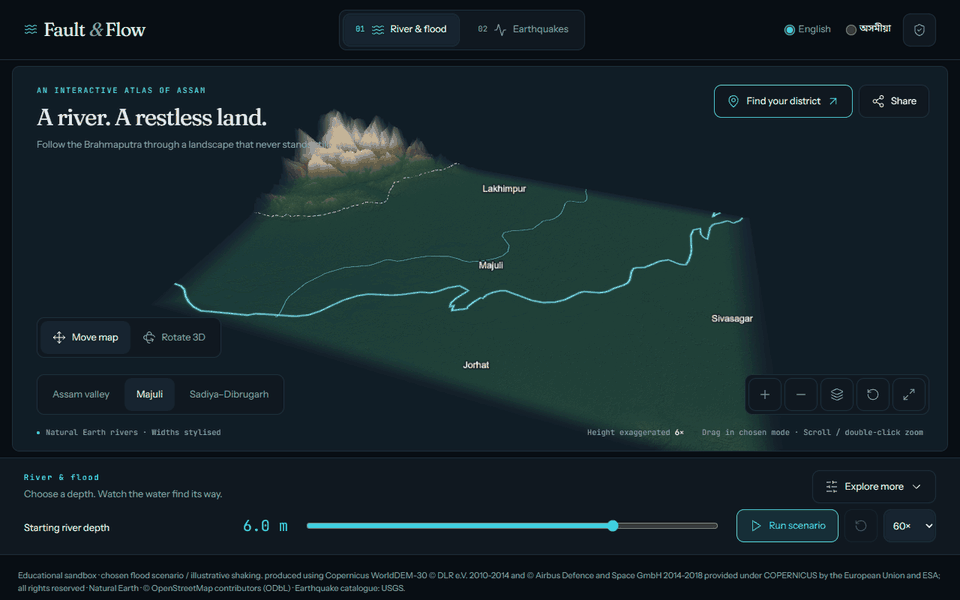
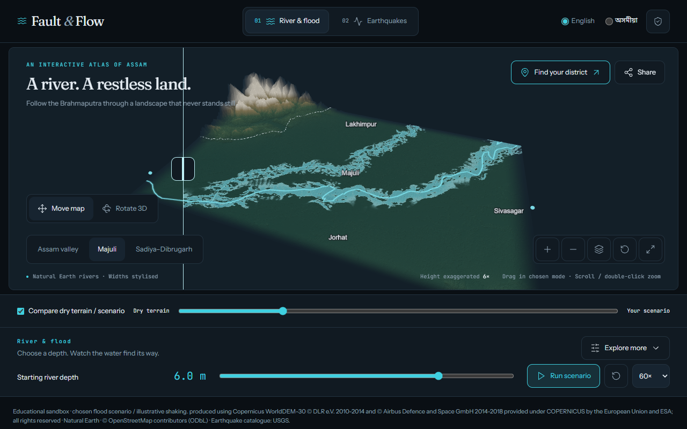
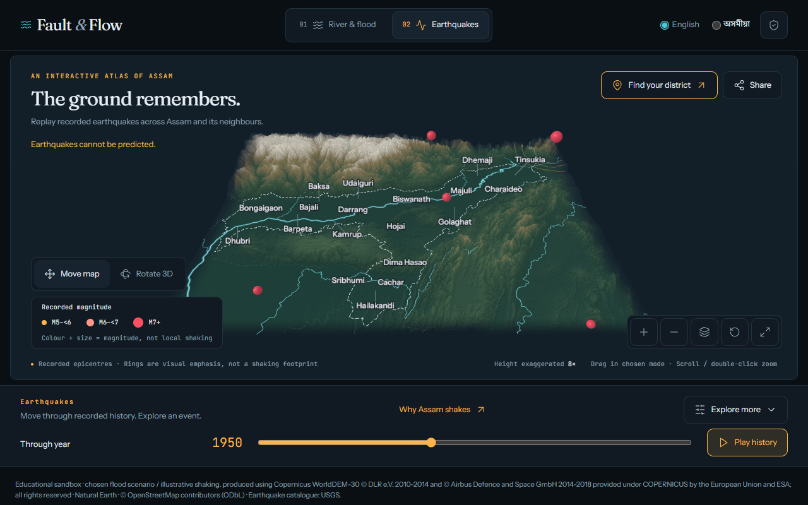

# Fault & Flow

### Explore Assam's earth and water.

**v0.2.0** · [Explore the live atlas](https://madb0i.github.io/Fault-and-Flow/) ·
[Releases](https://github.com/MadB0i/Fault-and-Flow/releases)

An interactive 3D educational atlas of the Brahmaputra valley. Choose a water
scenario, explore recorded earthquakes, and find your district in real terrain.
Browser only, with English and Assamese controls, self-hosted fonts and local
image/video exports. No accounts, API keys, backend or telemetry.



**Educational sandbox. Not a forecast, hazard map or prediction tool.**
Earthquakes cannot be predicted. Flood inputs are values the visitor chooses.
Water, wave rings and building motion are not warnings, local shaking measurements
or damage estimates.

## Explore

| Experience           | What you can do                                                                                                                                                                                                                                                                   |
| -------------------- | --------------------------------------------------------------------------------------------------------------------------------------------------------------------------------------------------------------------------------------------------------------------------------- |
| **River & flood**    | Explore Copernicus terrain across the Assam overview, Majuli and Sadiya–Dibrugarh. Choose starting water depth and optional inflow; run, pause and reset. Compare dry terrain against your scenario with the same camera. Switch depth styling and inspect a movable A–B section. |
| **Earthquakes**      | Scrub documented USGS M5+ history on the Assam overview. Filter M5+/M6+/M7+, tap a grounded symbol, read its date, magnitude type and depth, focus its epicentre and open the original record. Colours describe magnitude, not local shaking.                                     |
| **Why Assam shakes** | Open the secondary collision explainer from Earthquakes. Explore schematic plates, crustal layers and an explicitly invented miniature settlement. Choose illustration strength and replay the buildings' sway.                                                                   |
| **Your district**    | Search all 35 names in the committed OSM extract. Focus its administration-centre anchor and explore the nearest five catalogue records, with approximate anchor-to-epicentre distances and regional historical flood-report links.                                               |
| **Share**            | Preview an attributed 1080 × 1920 portrait PNG or save the full map. Record up to eight seconds of silent 720 × 1280 WebM with labels and credits. Share validated view links; they never automatically run water.                                                                |

An optional three-step tour follows your pace. Compact controls keep Play on the
first phone screen; Explore more opens details. Lite reduces display pixel
resolution on high-density screens, keeping the same data and water solver.





## Run locally

Requires **Node 20+**, npm and a WebGL2-capable browser.

```bash
npm ci
npm run dev
```

Open the URL printed by Vite. For a production build:

```bash
npm run build
npm run preview
```

When disk space is tight, keep downloads and temporary files on the project drive:

```powershell
$env:TEMP = 'D:\Projects\fault-and-flow\.cache\tmp'
$env:TMP = $env:TEMP
npm ci --cache D:/npm-cache
```

Create that directory first. No extra font CDN, framework, image service or video
encoder is needed to run the app. WebM depends on browser MediaRecorder support;
PNG and link sharing remain available.

## Controls

| Action            | Mouse / touch                                        | Keyboard                                      |
| ----------------- | ---------------------------------------------------- | --------------------------------------------- |
| Move              | Drag in **Move map**; two-finger pan                 | Canvas arrows; Shift-arrows always pan        |
| Rotate            | Select **Rotate 3D**, then drag                      | Arrows in Rotate 3D                           |
| Zoom into a place | Wheel at pointer, double-click, pinch or +/− buttons | +/− on the canvas                             |
| Reset             | Reset view button                                    | Home on the canvas                            |
| Open a quake      | Tap a symbol; zoom to separate close events          | Explore more → Records selector → source link |
| Compare water     | Run, enable comparison, drag the split               | Slider arrows / Home / End                    |

For video, start scenario/history playback, open Share, then choose
**Record 8-second portrait video**. Recording stays local and uses no camera or
microphone. The portrait is a labelled central crop, not the full viewport.
Fixed labels identify the context at recording start.

## Data and scientific limits

- **Terrain:** an adapted, resampled Copernicus surface model without surveyed
  riverbed bathymetry. Height exaggeration is stated in the UI.
- **Geography:** Natural Earth river/state/place layers. River widths are stylised.
- **District names:** OSM administration-centre anchors, not district polygons or
  centroids. The separate ODbL extract is downloadable. Nearest-event distances
  are not district hazard scores.
- **Earthquakes:** 289 recorded M5+ events in the committed NE India bounding-box
  subset, from 1900 to the **3 October 2026 UTC cutoff**. Coverage is incomplete,
  particularly in early years. The UI shows each build's cutoff and source records.
- **Water:** an illustrative chosen scenario, not a river gauge, pressure reading,
  calibrated inundation forecast or reconstruction of a historical flood.
  Surface, depth and comparison views share one solver state.
- **Motion:** rings, camera shake, plates and buildings are synthetic educational
  effects. No real building survey, shaking footprint or damage calculation exists.

Historical flood footprints, bank erosion, local hazard layers and live alert
feeds are not implemented. Assamese passes glyph coverage checks but needs
native-speaker review. Physical Android performance and manual screen-reader
testing remain follow-ups; 60fps is not claimed.

For current conditions and preparedness, use [ASDMA](https://asdma.assam.gov.in/),
[National Center for Seismology](https://seismo.gov.in/) and
[IMD](https://mausam.imd.gov.in/). The explainer preserves the date of ASDMA's
2022/BIS 2002 seismic-zone context; it is not a live red alert.

[Data and licences](docs/DATA.md) · [Product boundaries](PRODUCT.md) ·
[Remaining work](docs/ROADMAP.md)

## Updating history

```bash
npm run data:quakes:refresh
```

The Pages workflow refreshes earthquake history before its checked build,
including a daily scheduled run at **06:47 IST**. The workflow runs on `main`
with GitHub Actions and Pages. Schedules can
be delayed or disabled after inactivity; failed validation stops the new
deployment. Existing tabs keep their snapshot until reloaded. This does not
create a live warning service. See [Data updates](docs/DATA_UPDATES.md).

## Architecture

Vite + strict TypeScript. React owns the HUD; the imperative Three.js engine
imports no React or UI code. Zustand manages UI state. A small typed API connects
the two, with headless simulation/geometry tests. Tailwind/CSS tokens, motion and
self-hosted Fraunces, Instrument Sans, JetBrains Mono and Noto Sans Bengali
provide the bilingual interface.

[Architecture](docs/ARCHITECTURE.md) · [Design](DESIGN.md) ·
[Contributor rules](AGENTS.md) · [Interface review](docs/ATLAS_REVIEW.md)

## Verify and reproduce the media

```bash
npm run verify      # Prettier, ESLint, TypeScript, Vitest and production build
npm run e2e         # native Python browser checks through Playwright orchestration
npm run shots       # 1440px and 390px, English and Assamese
npm run contrast    # calculated palette contrast
```

Browser checks require Python 3 and its `playwright` package. Release checks and
GIF encoding also use Pillow. Reuse an existing Chromium executable:

```bash
python scripts/test-release.py --browser /path/to/chromium
python scripts/capture-release.py --browser /path/to/chromium
```

Run Vite first. Both scripts accept `--url`. The npm runner uses its configured
Chromium executable. Temporary outputs stay in `.cache/` on the project drive.
The GIF uses real browser frames and a shared palette. Every committed asset
must stay below 5 MB.

## Licence and attribution

Software: [MIT](LICENSE). Data and rendered derivatives retain their own licences;
MIT does not replace ODbL or Copernicus terms.

Terrain renders here and in the screenshots/GIF are **produced using Copernicus
WorldDEM-30 © DLR e.V. 2010-2014 and © Airbus Defence and Space GmbH 2014-2018
provided under COPERNICUS by the European Union and ESA; all rights reserved**.
The organisations in charge of the Copernicus programme by law or by delegation
do not incur any liability for any use of the Copernicus WorldDEM-30.

Natural Earth geography. Earthquake catalog data courtesy of the U.S. Geological
Survey. District names © OpenStreetMap contributors,
[ODbL](https://www.openstreetmap.org/copyright). See [Data](docs/DATA.md) for each
layer's actual terms and adaptations.
