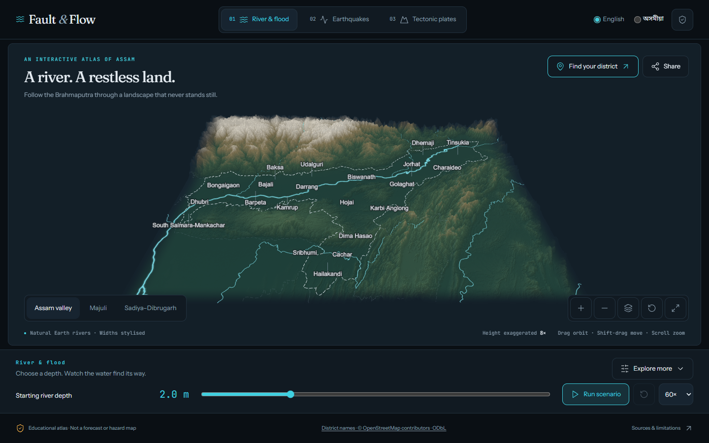

# Fault & Flow

> One plate pushes. One river answers.

An interactive 3D atlas of Assam's earth and water. Browser only, with English and
Assamese controls, no backend, accounts or telemetry.

- **FLOW:** Copernicus terrain with mapped rivers, state outlines and places.
  Choose a starting depth or scenario inflow and watch illustrative water spread.
  Explore the Assam overview, Majuli and Sadiya–Dibrugarh.
  Switch surface motion/depth bands and move an A–B cross-section through the
  actual solver depth field. The slice does not claim surveyed bathymetry,
  underground geology or pressure readings.
- **FAULT:** replay 289 recorded M5+ earthquakes from the documented USGS subset,
  scrub years, open an event's original catalogue record and try a clearly labelled synthetic ground-motion illustration with terrain-following waves.
  FAULT uses the full Assam view only.
- **PLATES:** explore an original schematic India–Eurasia collision diagram.
- Open source, risk and historical flood-report panels; save an attributed map PNG.
- Explore all 35 district names, search a district and focus its sourced
  administration centre. Zoom with wheel, pinch or buttons; Shift-drag pans.
  Share links restore the district, language, historical earthquake selection,
  FLOW region and chosen starting depth/inflow. They never auto-start water.
- A compact dock keeps Play and the main slider on the first phone screen;
  Explore more reveals depth layers, the cross-section and detailed records.
  Portrait phone framing follows the valley vertically. District labels use short
  leaders and declutter with zoom; all names remain searchable.
- Share opens a preview of a 1080 × 1920 portrait story with a labelled central
  map crop, district/region title, chosen context and wrapped source credits.
  Download the story or the original full-view map PNG. These are static images,
  not video exports; camera position and elapsed solver time are not in links.

**Educational sandbox, not a forecast, hazard map or prediction tool.** Earthquakes
cannot be predicted. Flood inputs are values you choose. Seismic rings and plate
geometry are illustrative. The committed catalogue is incomplete and cuts off at
3 October 2026 UTC. The app shows each built snapshot's actual cutoff.
Historical flood footprints, bank erosion and calibrated shaking effects
are not implemented. Assamese copy awaits native-speaker review.

Current warnings and preparedness: [ASDMA](https://asdma.assam.gov.in/),
[NCS](https://seismo.gov.in/), [IMD](https://mausam.imd.gov.in/).



## Run locally

Node 20+ and npm:

```bash
npm install
npm run dev
```

```bash
npm run verify       # formatting, lint, TypeScript, headless tests and build
npm run e2e          # desktop/mobile, both languages, axe, interactions and GPU checks
npm run shots        # all three modes at 1440px and 390px, both languages
npm run data:atlas   # small Natural Earth and USGS extracts; local .cache/atlas
npm run data:quakes:refresh # fresh validated historical USGS query, UTC cutoff
node scripts/build-districts.mjs # small OSM district-name extract; local cache
npm run contrast
```

Browser checks are native Python Playwright, launched through the npm Playwright
runner. They require Python 3 with its `playwright` package and Chromium installed
by `npx playwright install chromium`. Set `PYTHON` to an existing interpreter when
needed. The runner supplies the npm Chromium executable, so a second browser
download is unnecessary. Temporary browser profiles and test outputs stay inside
`.cache/` on the project drive.

For a drive with limited space, use `npm install --cache D:/npm-cache` and set
`TEMP`, `TMP` and `PLAYWRIGHT_BROWSERS_PATH` to directories on that drive before
any installation. No new browser download was needed for this implementation.

## Implementation and data

The Pages workflow now refreshes earthquake history before its checked build,
including a daily scheduled run at 06:47 IST. This becomes active only after the
workflow is on the default branch and GitHub Actions/Pages are enabled; no remote
deployment was performed by this change. GitHub schedules can be delayed or
disabled after inactivity. A network or validation failure stops the deployment,
leaving the existing site in place. See [data updates](docs/DATA_UPDATES.md).
FLOW inputs remain chosen scenarios, and official warnings remain linked.

District labels use OSM administration-centre anchors, not district centroids or
district polygons. Nearby names declutter at small scales; the full directory
remains searchable. The distinct OSM extract is ODbL, with a downloadable copy
and visible attribution. The software's MIT licence does not replace data licences.

Vite, strict TypeScript, React HUD, imperative Three.js engine, Zustand, Tailwind
and CSS-variable tokens, motion, Vitest and Playwright. Fonts are self-hosted.

The simulation and shared contract remain framework-free. Every scientific input
traces to a source and licence in [DATA.md](docs/DATA.md). Natural Earth geometry
is pinned to an author-maintained revision; ComCat contains event parameters only.
Raw data stays out of Git and no committed file exceeds 5 MB. Cached input rebuilds
are deterministic; a fresh ComCat request can contain revised catalogue records.

[Product](PRODUCT.md) · [Architecture](docs/ARCHITECTURE.md) ·
[Design](DESIGN.md) · [Decisions](docs/DECISIONS.md) · [Roadmap](docs/ROADMAP.md)

Licence: [MIT](LICENSE), with the third-party data terms documented separately.
